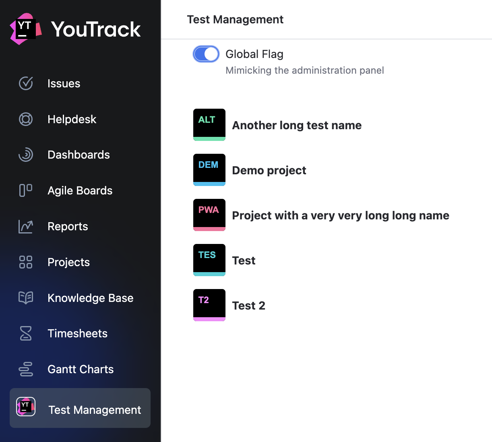

# YouTrack Test Management App

This is a sample YouTrack App built as part of a test assignment. It demonstrates how to use the YouTrack Apps API to render a UI inside the main menu and interact with both YouTrack's native endpoints and a custom backend.

---

## Task Description

The task was to create a YouTrack App that:

- Registers an extension point: `MAIN_MENU_ITEM`
- Renders a single page with:
  - A list of available projects
  - A toggle for a global boolean flag, mimicking a future test management admin panel
- Persists the toggle flag on the YouTrack server backend

**Technologies Used:**

- TypeScript
- React
- [Ring UI](https://github.com/JetBrains/ring-ui) (JetBrains’ internal design system)

---

## What’s Included in the Solution

### Components

- `FlagToggle` – A Ring UI toggle switch labeled "Global Flag"
- `ProjectList` – Renders a list of YouTrack projects with avatars

Both are located in the `/components` directory.

### Custom Hooks
- `useFlag`  → Handles flag state with `host.fetchApp()` to call custom `GET` and `POST` backend endpoints
- `useProjects`  → Fetches the list of available YouTrack projects using `host.fetchYouTrack()`

Hooks are located in the `/hooks` directory.

---

## Persistence Details

The toggle flag value is persisted using YouTrack’s **global extension storage**:

- Handlers are defined in `backend.js`
- Flag is stored via `ctx.globalStorage.extensionProperties`

For more details, see: [App Global Storage Reference](https://www.jetbrains.com/help/youtrack/devportal/apps-extension-properties.html#global-storage)

---

## Resources & References
- [YouTrack Server Installation: Docker container](https://www.jetbrains.com/help/youtrack/server/youtrack-docker-installation.html)
- [YouTrack Apps Documentation](https://www.jetbrains.com/help/youtrack/devportal/apps-get-started.html)
- [HTTP Handlers Reference](https://www.jetbrains.com/help/youtrack/devportal/apps-reference-http-handlers.html)
- [Global Extension Properties](https://www.jetbrains.com/help/youtrack/devportal/apps-extension-properties.html#global-storage)
- [Ring UI Toggle Guidelines](https://www.jetbrains.com/help/ring-ui/toggle-button.html)
- [Ring UI Storybook](https://jetbrains.github.io/ring-ui/master/index.html?path=/)
- [YouTrack Demo App](https://github.com/JetBrains/youtrack-demo-app/tree/main)

---

## Installation

To upload and run the app:

1. ZIP archive of the dist folder (dist.zip) is available in the root of the repository.
2. Upload the archive to your YouTrack instance via: **Administration > Apps > Add app > Upload ZIP file**.
3. Once uploaded, the app called "Test Management" will appear in the main menu.

For more details, see: [Upload the App to YouTrack](https://www.jetbrains.com/help/youtrack/devportal/apps-quick-start-guide.html#add-app-to-youtrack)

## Results
Flag is stored in the global extension storage and is available across sessions. The app also displays a list of available projects with their avatars.

